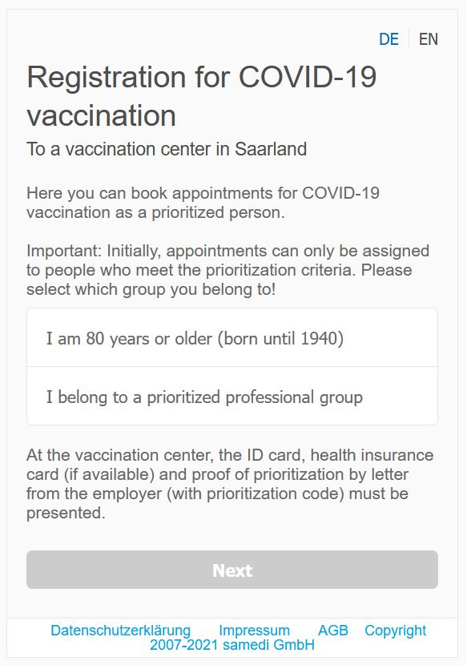

# Automatic Vaccination Availability Check for Saarland, Germany



Vaccinations appointments in [Saarland](https://en.wikipedia.org/wiki/Saarland), Germany can be scheduled [online](https://www.impfen-saarland.de/).
However, since there is no information on when new appointments will be open to the public, I built this small tool to check the current availability.
In addition to that, also direct booking of an appointment is possible.

This script sends an automatic message with the current status to a group in [Element](https://element.io/blog/welcome-to-element/) I created and triggers a computer sound when an appointment is available.

**Note** that the website is under active development (e.g. there was no `back` button during the time of development). Dialogues might change over time and thus, compatibility cannot be guarantied.

## Installation
Install necessary packages for Python3 with
```shell script
pip install -r requirements.txt
```
Also, download the [chrome driver](https://chromedriver.chromium.org/downloads) (must match your installed Chrome version) and adjust `DRIVER_PATH`.

## Usage
### General
Adjust the configuration:
- `PERSONAL_DATA`: `None` if no booking of appointment if wanted, otherwise fill out in [personal_data.py](../check_vaccination_availability%20-%20Copy%20(2)/personal_data.py).
- `SEND_MSG_RIOT `: `boolean` whether or not messages should be send. Note that a [token](https://webapps.stackexchange.com/a/138497) is needed and `MATRIX_ROOM_ID` must be changed.
- `SLEEP_TIME_BETWEEN_QUERIES_*`: configure the frequency in which the availability is checked.

Run the function
```shell script
python check_availability.py
```

### Using Elements to send messages
I used the [matrix-python-sdk](https://github.com/matrix-org/matrix-python-sdk), but also the [API](https://matrix.org/docs/api/client-server/#/Send45to45Device32messaging) can be used (check this [gist](https://gist.github.com/RickCogley/69f430d4418ae5498e8febab44d241c9)).
To find the room ID go the room `Settings` and select `Advanced`.


## Disclaimer
This was a small and quick project, so don't except the code to be too clean ;)

I hope it helps someone and feedback is always welcome!